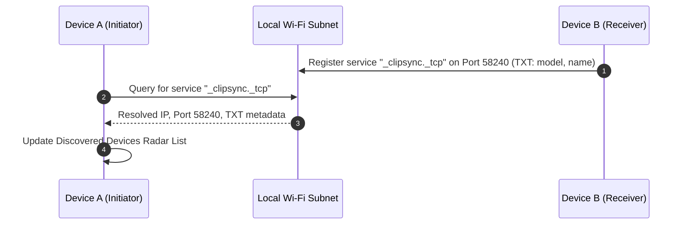
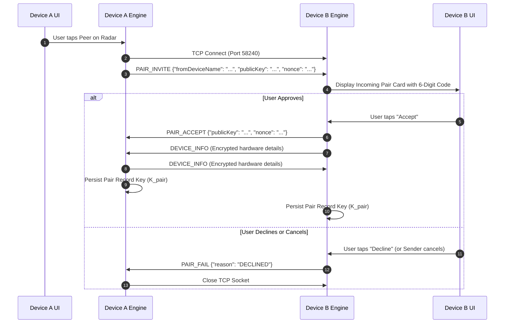
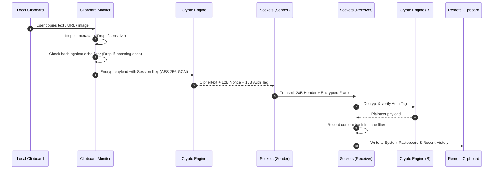
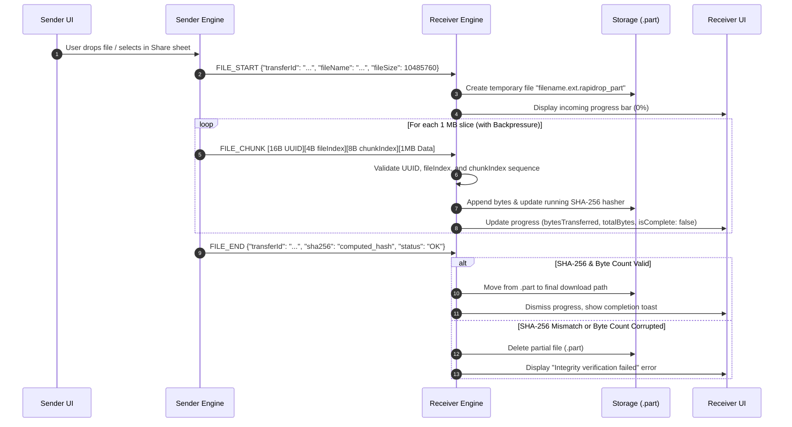

# System Architecture & Data Flow

RapiDrop is structured as a decentralized, zero-cloud peer-to-peer system that uses pure platform-native frameworks without intermediate cloud servers.

## 1. Subsystem Architecture Map

```
┌─────────────────────────────────────────────────────────────┐
│                      RapiDrop Core                          │
├─────────────────┬───────────────────┬───────────────────────┤
│  macOS Layer    │   Android Layer   │     Windows Layer     │
│  (Swift 6)      │   (Kotlin 2.0)    │     (.NET 10 / C#)    │
├─────────────────┼───────────────────┼───────────────────────┤
│ AppKit / SwiftUI│ Jetpack Compose   │ WPF / XAML            │
│ Network.fw      │ Java NIO Sockets  │ System.Net.Sockets    │
│ Apple CryptoKit │ javax.crypto / K2 │ System.Security.Crypto│
│ NSPasteboard    │ ClipboardManager  │ Win32 OleSetClipboard │
│ NSFileManager   │ MediaStore API    │ System.IO.FileStream  │
└─────────────────┴───────────────────┴───────────────────────┘
```

## 2. End-to-End Data Flows

### 2.1 Local Network Discovery Flow


### 2.2 Pairing & Trust Establishment Flow


### 2.3 Clipboard Synchronization Flow


### 2.4 Chunked File Streaming Flow


## 3. State Lifecycle & Watchdogs

* **Heartbeat Ping/Pong**: Senders dispatch a lightweight `PING` (`0x0001`) every 5 seconds over active idle connections. Receivers respond with `PONG` (`0x0002`).
* **Connection Watchdog**: If no packet or keepalive response is received within 16 seconds, the socket is cleanly torn down and auto-reconnect backoff is scheduled.
* **Auto-Reconnect Loop**: Attempts exponential backoff reconnects (1.5s $\rightarrow$ 3s $\rightarrow$ 6s $\dots$ capped at 20s) when paired peers are on the network.
