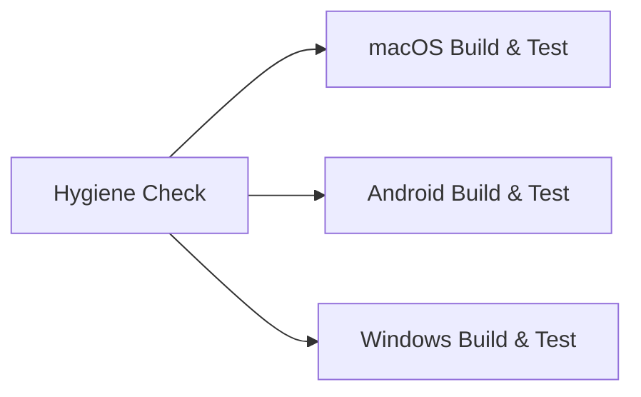
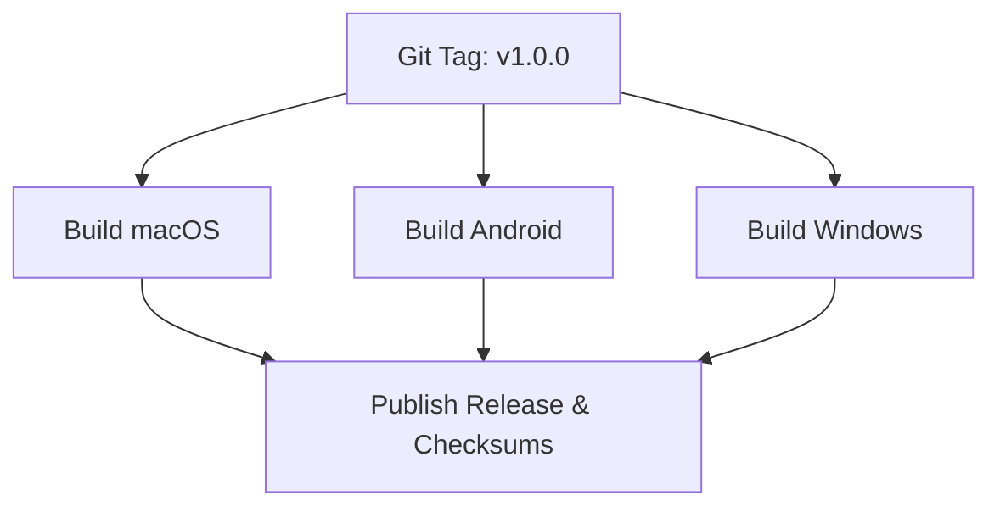

# Operations, Packaging & CI/CD Pipelines

This document details automated build workflows, release packaging procedures, and CI/CD matrix execution.

## 1. Continuous Integration (`ci.yml`)

The repository runs automated continuous integration on GitHub Actions on every push to `main` and pull request:



### CI Jobs
1. **`hygiene-check`** (`ubuntu-latest`):
   - Audits working tree for accidental desktop metadata (`.DS_Store`, `Thumbs.db`, `*.userosscache`).
2. **`macos`** (`macos-14`):
   - Runs `swift test --package-path macos`.
   - Packages macOS `.app` bundle via `./macos/package.sh --all`.
3. **`android`** (`ubuntu-latest`):
   - Sets up JDK 17 (Temurin) with Gradle caching.
   - Runs `./gradlew test --stacktrace`.
   - Assembles release APK via `./gradlew assembleRelease --stacktrace`.
4. **`windows`** (`windows-latest`):
   - Sets up .NET 10.0 SDK.
   - Runs `dotnet test windows/tests/RapiDrop.Tests/RapiDrop.Tests.csproj -f net10.0`.
   - Publishes single-file executable via `dotnet publish`.

## 2. Automated Release Workflow (`release.yml`)

When a release tag (`v*`) is pushed or manually triggered via `workflow_dispatch`, GitHub Actions automatically compiles, packages, checksums, and publishes artifacts to [GitHub Releases](https://github.com/Prabotics/RapiDrop/releases):



### Published Release Artifacts
| Artifact | Platform | Description |
| :--- | :--- | :--- |
| `RapiDrop-macOS.dmg` | macOS | Drag-and-drop disk image with `/Applications` symlink |
| `RapiDrop-macOS.zip` | macOS | Compressed `.app` application bundle archive |
| `RapiDrop.apk` | Android | Universal release APK (minified with R8) |
| `RapiDrop-Standalone-x64.exe` | Windows | Self-contained single-file compressed binary (Intel / AMD) |
| `RapiDrop-Standalone-arm64.exe` | Windows | Self-contained single-file compressed binary (ARM64 / Copilot+) |
| `RapiDrop-x64.exe` | Windows | Framework-dependent single-file binary (.NET 10 runtime required) |
| `RapiDrop-arm64.exe` | Windows | Framework-dependent single-file binary (.NET 10 runtime required) |
| `RapiDrop-Windows-x64.zip` | Windows | Compressed Windows x64 distribution archive |
| `RapiDrop-Windows-arm64.zip` | Windows | Compressed Windows ARM64 distribution archive |
| `SHA256SUMS.txt` | All | Cryptographic SHA-256 integrity digests for all artifacts |

### Triggering a Release
```bash
git tag v1.0.0
git push origin v1.0.0
```

## 3. Local Packaging Procedures

### macOS
`macos/package.sh` automates the generation of native release bundles:
```bash
./macos/package.sh --all
```
Options:
- `--all`: Builds `.app`, `.dmg`, and `.zip`.
- `--dmg`: Builds `.app` and `.dmg`.
- `--zip`: Builds `.app` and `.zip`.
- `--app-only`: Builds only `RapiDrop.app`.

### Android
```bash
cd android
./gradlew assembleRelease
```
Output: `android/app/build/outputs/apk/release/app-release.apk`.

cd windows

# Self-contained compressed standalone binary (x64 / arm64)
dotnet publish src/RapiDrop.UI/RapiDrop.UI.csproj -f net10.0-windows -c Release -r win-x64 -p:PublishSingleFile=true -p:IncludeNativeLibrariesForSelfExtract=true -p:EnableCompressionInSingleFile=true --self-contained true
dotnet publish src/RapiDrop.UI/RapiDrop.UI.csproj -f net10.0-windows -c Release -r win-arm64 -p:PublishSingleFile=true -p:IncludeNativeLibrariesForSelfExtract=true -p:EnableCompressionInSingleFile=true --self-contained true

# Framework-dependent binary (.NET 10 runtime required)
dotnet publish src/RapiDrop.UI/RapiDrop.UI.csproj -f net10.0-windows -c Release -r win-x64 -p:PublishSingleFile=true -p:IncludeNativeLibrariesForSelfExtract=true --self-contained false
dotnet publish src/RapiDrop.UI/RapiDrop.UI.csproj -f net10.0-windows -c Release -r win-arm64 -p:PublishSingleFile=true -p:IncludeNativeLibrariesForSelfExtract=true --self-contained false
